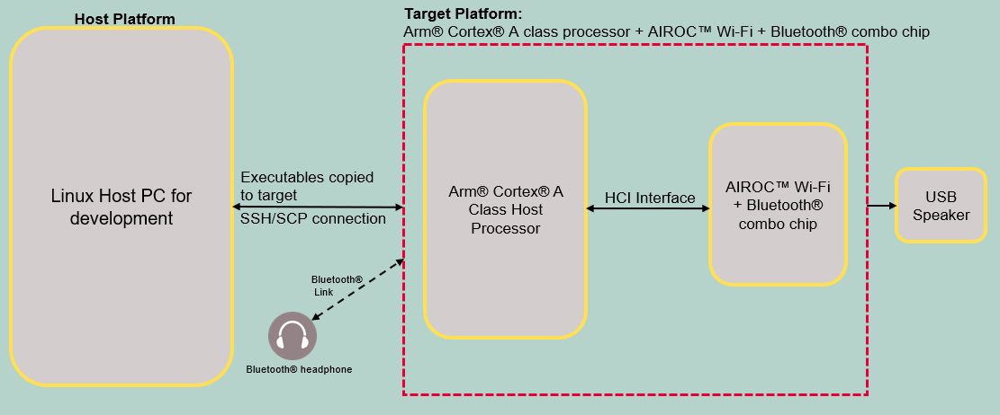
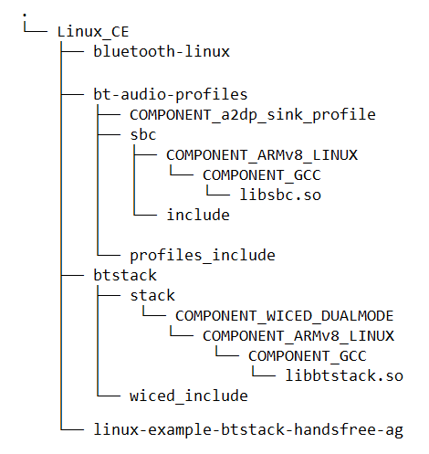
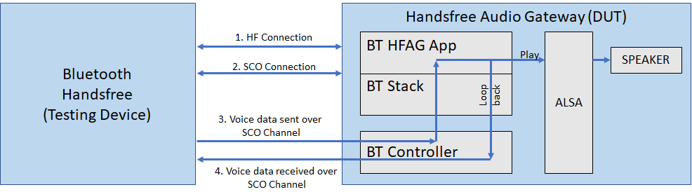
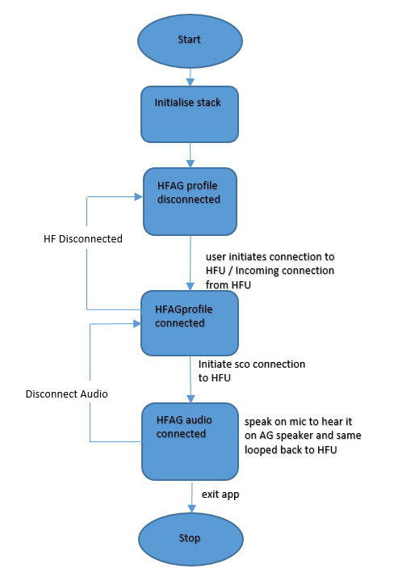

# AIROC™ BTSTACK: Bluetooth® Handsfree Audio Gateway for Linux host

The code example demonstrates a Handsfree Audio Gateway using AIROC™ Wi-Fi & Bluetooth® Combo Chip on Linux platform.

[View this README on GitHub.](https://github.com/Infineon/linux-example-btstack-handsfree-ag)

[Provide feedback on this code example.](https://cypress.co1.qualtrics.com/jfe/form/SV_1NTns53sK2yiljn?Q_EED=eyJVbmlxdWUgRG9jIElkIjoiQ0UyMzY4OTQiLCJTcGVjIE51bWJlciI6IjAwMi0zNjg5NCIsIkRvYyBUaXRsZSI6IkFJUk9D4oSiIEJUU1RBQ0s6IEJsdWV0b290aMKuIEhhbmRzZnJlZSBBdWRpbyBHYXRld2F5IGZvciBMaW51eCBob3N0IiwicmlkIjoid2FuZyBwaW5nIGNodW4iLCJEb2MgdmVyc2lvbiI6IjEuMC4wIiwiRG9jIExhbmd1YWdlIjoiRW5nbGlzaCIsIkRvYyBEaXZpc2lvbiI6Ik1DRCIsIkRvYyBCVSI6IklDVyIsIkRvYyBGYW1pbHkiOiJBSVJPQyJ9)

## Requirements

- Programming language: C
- Embedded Linux platforms (Arm® Cortex®-A Class processors) for host communications. Supported Embedded Linux host platforms:
   1. RPI CM4-lite IFX custom HW board from Infineon
   2. [IMX8 nano uCOM board](https://www.embeddedartists.com/products/imx8m-nano-developers-kit-v3/) from Embedded Artists
- AIROC™ BTSTACK library and Linux porting layer source code
- AIROC™ Wi-Fi & Bluetooth® Combo Chip Bluetooth® firmware file (*.hcd*).
- Linux Host PC with Ubuntu 20.04


## Supported toolchains (make variable 'TOOLCHAIN')

- GNU Arm® GCC AArch64 v9.3.0 (`GCC_ARM`)

## Supported AIROC™ Wi-Fi & Bluetooth® Combo Chip

- [AIROC™ CYW5557x Wi-Fi & Bluetooth® Combo Chip](https://www.infineon.com/cms/en/product/wireless-connectivity/airoc-wi-fi-plus-bluetooth-combos/wi-fi-6-6e-802.11ax/)

## Hardware setup

Set up the hardware according to the following diagram:

**Figure 1. Block diagram: Hardware setup**



## Software setup

Set up a cross compiler according to the target platform along with CMake on the Linux host PC based on Ubuntu 20.04.

**Note:** These steps are for Arm&reg; 64-based target platform. Review these steps before adding support for any other target.

1. Open a terminal on the Linux host PC.

2. Use the following command to install the cross compiler, build tools, and dependencies:
   ```bash
   sudo apt-get install git cmake gcc-aarch64-linux-gnu build-essential -y
   ```

## Using the code example

Do the following on the Linux host PC to compile the code example:

1. Create a directory under `$HOME` on the Linux host PC and switch to the created directory. Use the following commands:
   ```bash
   mkdir $HOME/Linux_CE
   cd $HOME/Linux_CE
   ```
   **Note:** Replace *Linux_CE* with a directory of your choice.

2. Fetch the code example source code using the following command:
   ```bash
   git clone https://github.com/Infineon/linux-example-btstack-handsfree-ag
   ```

3. Clone the code example dependencies (BTSTACK library and Linux porting layer source code) using the following commands:
   ```bash
   git clone https://github.com/Infineon/btstack --branch release-v3.6.0
   git clone https://github.com/Infineon/bluetooth-linux.git --branch release-v1.0.0
   git clone https://github.com/Infineon/bt-audio-profiles.git --branch release-v1.0.0
   ```

   **Figure 2. Code example directory structure**

   

4. Clone the Bluetooth® firmware using following command:
   ```bash
   git clone https://github.com/Infineon/combo-bluetooth-firmware.git
   ```
   The user can choose appropriate Bluetooth® firmware for particular AIROC™ Wi-Fi & Bluetooth® combo chip from cloned "combo-bluetooth-firmware" directory.

5. Create the build folder under the code example source folder and build the code example using the following commands:
   ```
   cd $HOME/Linux_CE/linux-example-btstack-handsfree-ag
   mkdir build && cd build
   cmake -DCMAKE_C_COMPILER:PATH=<GCC_CROSS_COMPILER> ../ && make
   ```
   Where,
   - `GCC_CROSS_COMPILER` is the target cross compiler for GCC (generally */usr/bin/aarch64-linux-gnu-gcc* for ARM64-based targets).

   The code example executable is generated under the *build* folder with the same name of code example.

   For example, in this project, the "linux-example-btstack-handsfree-ag" executable is generated at */home/$USER/Linux_CE/linux-example-btstack-handsfree-ag/build*.

## Operation

The code example acts as a Handsfree Audio Gateway. The Linux code example (DUT) device will be the Handsfree Audio Gateway from where the voice data will be routed to the remote handsfree unit.

### Devices used

- **Device Under Test (DUT):** Embedded Linux host platforms with AIROC™ Wi-Fi & Bluetooth® Combo Chip (target platform) that runs the Handsfree Audio Gateway code example.

   Role: Handsfree Audio Gateway (HFAG)

- **Testing device:** Bluetooth® Handsfree device (headphones, earphones, or car kits) that support the Handsfree Unit Bluetooth® profile.

   Role: Handsfree Unit (HFU)
   
   This code example is tested to be working with the following Handsfree Units:

   1. Bose handsfree headphone (SoundTrue AE2)
   2. Supertooth handsfree car kit (Buddy CE0678)
   3. Jabra handsfree speaker phone (Jabra PHS002W)
   4. JBL Tune 215BT

### Operation procedure

**Note:** The size of the bonded device list is 1; therefore, only one device's pairing information can be stored at a time.

1. Copy the code example executable, AIROC™ BTSTACK library, audio profiles source code, Linux audio library, and Bluetooth® firmware file from the Linux host PC to the target platform using [SCP](https://help.ubuntu.com/community/SSH/TransferFiles). For example, use the following commands.
   ```bash
   cd $HOME/Linux_CE/linux-example-btstack-handsfree-ag/build
   scp linux-example-btstack-handsfree-ag <TARGET_USER>@<TARGET_IP>:<TARGET_PATH>/.
   cd $HOME/Linux_CE/btstack/stack/COMPONENT_WICED_DUALMODE/COMPONENT_ARMv8_LINUX/COMPONENT_GCC
   scp libbtstack.so <TARGET_USER>@<TARGET_IP>:<TARGET_PATH>/.
   cd $HOME/Linux_CE/bt-audio-profiles/sbc/COMPONENT_ARMv8_LINUX/COMPONENT_GCC/
   sudo scp -r libsbc.so <TARGET_USER>@<TARGET_IP>:<TARGET_PATH>/.
   scp <FW_FILE.hcd> <TARGET_USER>@<TARGET_IP>:<TARGET_PATH>/.
   ```
   Where,
   - `TARGET_USER` is the user name of the target platform.
   - `TARGET_IP` is an IP address of the target platform.
   - `TARGET_PATH` is the path of target platform.
   - *`FW_FILE.hcd`* file is Bluetooth® firmware file cloned in step-4 of [Using the code example section](#using-the-code-example).

2. Take SSH console of target platform.
   ```bash
   ssh <TARGET_DEVICE_USER_NAME>@<TARGET_DEVICE_IP_ADDRESS>
   ```

3. Add the udev rule in the target board for HCI UART and GPIO to bypass root access. Use the following steps to create and set up an udev rule.

   **Note:** If you have root access, the following udev rules are not required; you can execute the code example with `sudo` permissions or by switching to the root user.

   1. Create a new *.rules* (for example, *combo-chip-uart-port.rules*) file under */etc/udev/rules.d/* directory for HCI UART. Use the following commands:

      **IMX8Nano:**

      ```bash
      echo "KERNEL==\"ttymxc0\"d,SYMLINK+=\"combo_chip_uart\",MODE=\"0666\"" | sudo tee /etc/udev/rules.d/combo-chip-uart-port.rules
      ```

      **RPICM4:**

      ```bash
      echo "KERNEL==\"ttyAMA0\",SYMLINK+=\"combo_chip_uart\",MODE=\"0666\"" | sudo tee /etc/udev/rules.d/combo-chip-uart-port.rules
      ```

   2. Create new *.rules* (for example, *combo-chip-gpio-port.rules*) for BT_REG_ON GPIO under */etc/udev/rules.d/*. Use the following commands:

      **IMX8Nano and RPICM4:**

      1. Create a rule file using the following command.

         ```bash
         sudo vim /etc/udev/rules.d/combo-chip-gpio-port.rules.rules
         ```

      2. Add the following rules in created files:

         ```bash
         SUBSYSTEM=="gpio*", PROGRAM="/bin/sh -c 'chown -R $user:$group /sys/class/gpio/export /sys/class/gpio/unexport;'"
         SUBSYSTEM=="gpio*", PROGRAM="/bin/sh -c 'chown -R $user:$group /sys%p/direction /sys%p/value; chmod 660 /sys%p/direction /sys%p/value;'"
         ```

   3. Reboot the target device:

      ```bash
      sudo reboot
      ```

       Where,

      - `ttymxc0` and `ttyAMA0` are HCI UART ports for IMX8Nano and RPICM4 respectively.
      - `combo_chip_uart` is a friendly name for the HCI UART port.
      - `0666` is the permission mask to bypass the root access for HCI UART.

4. Set the default audio sink (USB speaker connected to target board) to the selected audio rendering device.
   ```bash
   pacmd set-default-sink <SINK_INDEX>
   ```
   Where,
   - `SINK_INDEX` is the index of connected audio sink device.  
   The user can refer [these steps to learn how to identify and set default sink device using pulseaudio](https://wiki.archlinux.org/title/PulseAudio/Examples#Set_the_default_output_sink).

5. Execute the application with setting the paths of the AIROC™ BTSTACK library using the following command on the target platform:

   ```bash
   cd <TARGET_PATH>
   chmod +x <APP_NAME>
   LD_LIBRARY_PATH=$LD_LIBRARY_PATH:<BTSTACK_LIB_PATH>
   ./<APP_NAME> -c <COM_PORT> -b 3000000 -f 921600 -r <GPIOCHIPx> <REGONPIN> -n -p <FW_FILE_NAME>.hcd -d 112233221189
   ```
   Where,
   - `APP_NAME` is the code example application executable.
   - `TARGET_PATH` is the path of the target platform where the code example application copied to.
   - `BTSTACK_LIB_PATH` is the path of the AIROC™ BTSTACK library. Skip this if the AIROC™ BTSTACK library and code example application executable are in the same folder.
   - `/dev/ttymxc0` is the COM_PORT for IMX8Nano.
   - `/dev/ttyAMA0` is the COM_PORT for RPICM4.
   - `3000000` is the HCI baud rate.
   - `112233221189` is a device BD address.
   - `-r <GPIOCHIPx> <REGONPIN> -n`  is setting the GPIO control to enable autobaud for AIROC™ Wi-Fi & Bluetooth® Combo Chip
      - `-r gpiochip5 0 -n`  For IMX8Nano
      - `-r gpiochip0 3 -n`  For RPICM4
   - `921600` is the firmware download baud rate.
   - *`.hcd`* is the firmware file to download (make sure to validate this firmware file file path).

      **Note:** Currently, random BD addresses are used for testing.

6. Do the following to set up an audio call using the Handsfree Audio Gateway code example:

    1. Note that the following HFAG menu options are displayed when the code example is executed:

      ```bash
      ---------------------HFAG MENU-----------------------

         0.  Exit
         1.  Print Menu
         2.  Set Visibility
         3.  Set Pairing Mode
         4.  Set Inquiry
         5.  HFAG Connect
         6.  HFAG Disconnect
         7.  Audio Connect
         8.  Audio Disconnect
         9.  Print HFAG Connection Details
         10. Send AG cmd str
         Choose option ->
      ```

    2. Set the DUT to *Discoverable* and *Connectable*:

       1. Choose **Option 2** (Set Visibility)

       2. Enter discoverability:

          0: Non Discoverable, 1: Discoverable

       3. Enter "1" to make it discoverable.

       4. Enter connectability:

          0: Non Connectable, 1: Connectable

       5. Enter "1" to make it connectable.

    3. Set the DUT to *Pairable*:

       1. Choose **Option 3** (Set Pairing Mode).

       2. Enter whether pairing is allowed:

          0: Not allowed, 1: Allowed

       3. Enter "1" to make it pairable.

    4. Initiate a HF connection from HFAG as follows:

       1. Choose **Option 4** (Set Inquiry).

       2. Enter whether inquiry must be enabled or disabled:

          0: Disabled, 1: Enabled

       3. Enter "1".
           ```
           --------------------------------------------
           10:33:10.671   Inquiry Result: 08 DF 1F 82 6D 8A
           10:33:10.671   Clock Offset = 0xc06a
           10:33:10.671   RSSI = -94
           --------------------------------------------
           Inquiry Complete

           Choose option -> 5 (HF Connect)
           Enter Peer BD Address:
           8A 6D 82 1F DF 08
           ```

    5. Initiate an audio connection with the handsfree unit. Do the following:

       1. Choose **Option 7** (Audio Connect).
           ```
           ----------------HFAG CONNECTION DETAILS----------------------------
           BD ADDRESS               CONNECTION HANDLE       SCO INDEX
           08 DF 1F 82 6D 8A        1                       0
           ---------------------------------------------------
          ```
       2. Enter the Connection Handle: In this case, it is '1'.

    6. Similarly, use **Option 8** for disconnecting the audio and **Option 6** to disconnect the HF connection.

    7. Choose **Option 10** to send any HFAG commands:
         ```
         Choose Option 10
         ----------------HFAG CONNECTION DETAILS----------------------------
         BD ADDRESS 		 CONNECTION HANDLE 	 SCO INDEX
         08 DF 1F 82 6D 8A 	 1 			 0
         --------------------------------------------------------------------
         Enter the Connection Handle: 1
         Enter the AG cmd str: +CIND: 1,1
         ```

       **Note:** Run the application without any arguments to get the details of command-line arguments. At any instance, choose **Option 1** to print the menu options.

    8. Choose **Option 9** to print the connection details at any instance.

## Debugging

You can debug the example using a generic Linux debugging mechanism such as the following:

- **Debugging by logging:** Add required prints in the application and check them during execution.

- **Debugging using GDB:** See the [GDB man page](https://linux.die.net/man/1/gdb) for more details.


## Design and implementation

**Figure 3. Communication flow**



This code example does the following:

1. Creates a handsfree connection between the Handsfree Audio Gateway and the unit either by initiating from the audio gateway or the unit.

2. Creates a Synchronous Connection Oriented Link (SCO) audio channel between the Handsfree Unit (testing device) and the Handsfree Audio Gateway (DUT) either by initiating from the audio gateway or unit.

3. Sends the voice data captured on the Bluetooth&reg; handsfree unit (testing device) to the HFAG. The Bluetooth&reg; controller on the HFAG decodes the data and sends it over HCI to the application. The application gives the pulse-code modulation (PCM) SCO data (received via callback from the stack) to ALSA for playback.

4. Loops back the SCO data received as-is to the Bluetooth&reg; stack to be sent to the Bluetooth&reg; handsfree device (testing device).

**Figure 4. Flowchart**

 


## Source file details

 File   | Description
 ------- | ---------------------
 *app/main.c*  | Implements the main function which takes the user command-line inputs. Implements a command-line interface to take user inputs and acts accordingly.
 *app/hfag.c*  | Implements HFAG application functionalities
 *app/audio_platform_common.c* | Interface file for taking input and providing output to the ALSA driver
 *app_bt_config/wiced_bt_config.c*  |Pre-generated using the Bluetooth&reg; Configurator on Windows. Contains configurations related to Bluetooth&reg; GAP settings and handsfree unit.
 *include/hfag.h*  | Header file for Handsfree Audio Gateway code
 *include/audio_platform_common.h* | Header file for *audio_platform_common.h*

### Resources and settings

**Table 1. Application resources**

 Resource  |  Alias/object     |    Purpose
 :-------- | :-------------    | :------------
 UART |HCI| Used for HCI communication with the host system
 ALSA |ALSA| Software framework and part of the Linux kernel that provides an API for sound card device drivers. Required for rendering audio

 **Table 2. Application Abbreviations**

 Abbreviations  |  Definition
 :-------- | :------------
 HFP | Hands-Free Profile
 HFAG | Handsfree Audio Gateway
 SCO | Synchronous Connection Oriented
 SBC | Low Complexity Subband Coding
 PCM | Pulse code modulation
 HCI | Host controller interface
 UART | Universal asynchronous receiver-transmitter
 ALSA | Advanced Linux Sound Architecture

<br>

## Related resources

Resources  | Links
-----------|----------------------------------
Device documentation | [CYW5557x](https://www.infineon.com/cms/en/product/wireless-connectivity/airoc-wi-fi-plus-bluetooth-combos/cyw5557x/)
AIROC™ BTSTACK library | [AIROC™ BTSTACK library](https://github.com/Infineon/btstack/tree/release-v3.6.0)
Linux porting layer source code | [Linux porting layer source code](https://github.com/Infineon/bluetooth-linux/tree/release-v1.0.0)

## Other resources

Infineon provides a wealth of data at [www.infineon.com](https://www.infineon.com/) to help you select the right device, and quickly and effectively integrate it into your design.

## Document history

Document title: *CE236894* – *AIROC™ BTSTACK: Bluetooth® Handsfree Audio Gateway for Linux host*

 Version | Description of change
 ------- | ---------------------
 1.0.0   | New code example

<br>

---------------------------------------------------------

© Cypress Semiconductor Corporation, 2023. This document is the property of Cypress Semiconductor Corporation, an Infineon Technologies company, and its affiliates ("Cypress").  This document, including any software or firmware included or referenced in this document ("Software"), is owned by Cypress under the intellectual property laws and treaties of the United States and other countries worldwide.  Cypress reserves all rights under such laws and treaties and does not, except as specifically stated in this paragraph, grant any license under its patents, copyrights, trademarks, or other intellectual property rights.  If the Software is not accompanied by a license agreement and you do not otherwise have a written agreement with Cypress governing the use of the Software, then Cypress hereby grants you a personal, non-exclusive, nontransferable license (without the right to sublicense) (1) under its copyright rights in the Software (a) for Software provided in source code form, to modify and reproduce the Software solely for use with Cypress hardware products, only internally within your organization, and (b) to distribute the Software in binary code form externally to end users (either directly or indirectly through resellers and distributors), solely for use on Cypress hardware product units, and (2) under those claims of Cypress’s patents that are infringed by the Software (as provided by Cypress, unmodified) to make, use, distribute, and import the Software solely for use with Cypress hardware products.  Any other use, reproduction, modification, translation, or compilation of the Software is prohibited.
<br>
TO THE EXTENT PERMITTED BY APPLICABLE LAW, CYPRESS MAKES NO WARRANTY OF ANY KIND, EXPRESS OR IMPLIED, WITH REGARD TO THIS DOCUMENT OR ANY SOFTWARE OR ACCOMPANYING HARDWARE, INCLUDING, BUT NOT LIMITED TO, THE IMPLIED WARRANTIES OF MERCHANTABILITY AND FITNESS FOR A PARTICULAR PURPOSE.  No computing device can be absolutely secure.  Therefore, despite security measures implemented in Cypress hardware or software products, Cypress shall have no liability arising out of any security breach, such as unauthorized access to or use of a Cypress product. CYPRESS DOES NOT REPRESENT, WARRANT, OR GUARANTEE THAT CYPRESS PRODUCTS, OR SYSTEMS CREATED USING CYPRESS PRODUCTS, WILL BE FREE FROM CORRUPTION, ATTACK, VIRUSES, INTERFERENCE, HACKING, DATA LOSS OR THEFT, OR OTHER SECURITY INTRUSION (collectively, "Security Breach").  Cypress disclaims any liability relating to any Security Breach, and you shall and hereby do release Cypress from any claim, damage, or other liability arising from any Security Breach.  In addition, the products described in these materials may contain design defects or errors known as errata which may cause the product to deviate from published specifications. To the extent permitted by applicable law, Cypress reserves the right to make changes to this document without further notice. Cypress does not assume any liability arising out of the application or use of any product or circuit described in this document. Any information provided in this document, including any sample design information or programming code, is provided only for reference purposes.  It is the responsibility of the user of this document to properly design, program, and test the functionality and safety of any application made of this information and any resulting product.  "High-Risk Device" means any device or system whose failure could cause personal injury, death, or property damage.  Examples of High-Risk Devices are weapons, nuclear installations, surgical implants, and other medical devices.  "Critical Component" means any component of a High-Risk Device whose failure to perform can be reasonably expected to cause, directly or indirectly, the failure of the High-Risk Device, or to affect its safety or effectiveness.  Cypress is not liable, in whole or in part, and you shall and hereby do release Cypress from any claim, damage, or other liability arising from any use of a Cypress product as a Critical Component in a High-Risk Device. You shall indemnify and hold Cypress, including its affiliates, and its directors, officers, employees, agents, distributors, and assigns harmless from and against all claims, costs, damages, and expenses, arising out of any claim, including claims for product liability, personal injury or death, or property damage arising from any use of a Cypress product as a Critical Component in a High-Risk Device. Cypress products are not intended or authorized for use as a Critical Component in any High-Risk Device except to the limited extent that (i) Cypress’s published data sheet for the product explicitly states Cypress has qualified the product for use in a specific High-Risk Device, or (ii) Cypress has given you advance written authorization to use the product as a Critical Component in the specific High-Risk Device and you have signed a separate indemnification agreement.
<br>
Cypress, the Cypress logo, and combinations thereof, WICED, ModusToolbox, PSoC, CapSense, EZ-USB, F-RAM, and Traveo are trademarks or registered trademarks of Cypress or a subsidiary of Cypress in the United States or in other countries. For a more complete list of Cypress trademarks, visit www.infineon.com. Other names and brands may be claimed as property of their respective owners.
